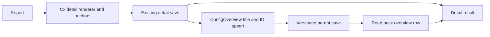

# Configuration page export architecture

This document covers the Jira `projectConfig` and Confluence `spaceConfig` page-export paths. Other endpoints have separate responsibilities described by their administrator guides.

Each endpoint remains a standalone ScriptRunner file. `Cx.render` builds the existing detail tables, Expand macros, Remark carry-over and truncation notices. It also collects section identities and counts and adds an invisible Anchor macro immediately before each section's Expand macro. `ExportOutcome.sections` passes those summaries to the overview updater.

`ConfigOverview` owns the managed table's storage format, identity parsing, title/ID matching and native page/anchor links. Start/end anchors delimit the managed region; column anchors hold stable section kinds and row anchors hold page IDs. Existing content outside the region is retained verbatim. Jira and Confluence have separate product markers, so both tables may coexist on one parent. New section kinds extend the columns without discarding older rows.

`OverviewExport.maintain` runs after successful detail export. Its read/write callbacks keep platform APIs out of the pure helper classes. It reads a fresh parent body and version, upserts by linked title with ID fallback, saves, then verifies the actual row and newer version at the target. Its outcome is independent of the detail export: `skipped`, `updated`, `failed` or `unknown`.

Jira retains its administrator gate and authenticated application-link factory. `confluenceOverviewRead` expands body storage, version and space through `confluenceCall`; `confluenceOverviewWrite` sends a versioned body update without changing ancestors. Confluence retains its administrator gate and existing PageService/PageManager APIs, cloning the original parent before saving with notifications suppressed. No new credentials, scopes or alternate transport are introduced.

The overview adds names, section counts and links, not configuration property values. Detail property-value guards and Remark parsing remain in their existing locations. Page restrictions and transport permissions remain platform responsibilities; live behavior is verified on the target instance rather than inferred from offline tests.

The embedded pure helper classes are byte-identical in both endpoint files. `tools/tests/export-overview.tests.groovy` runs against each endpoint's actual extracted classes and checks their parity. `python3 tools/run-config-tests.py` runs the two source-based suites, endpoint parse checks and `tools/config-overview-typecheck.groovy`. The latter statically checks `ConfigOverview` and `OverviewExport` against their actual platform-free dependencies, loaded dynamically, and fails on diagnostics. CI runs the same static gate for both configuration endpoints. This does not replace instance-classpath checking of platform-dependent code. `python3 tools/shared-renderer-drift.py` checks existing shared renderer contracts.
